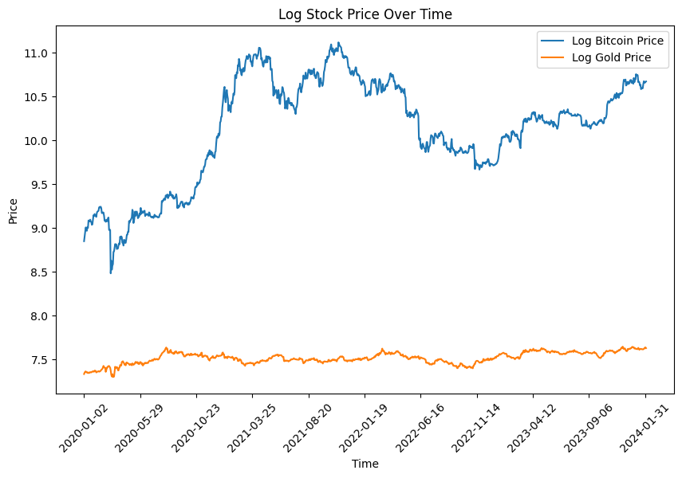
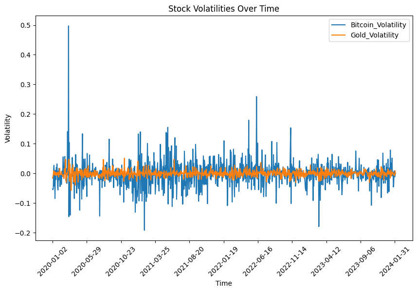
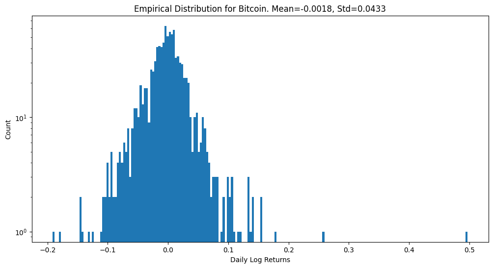
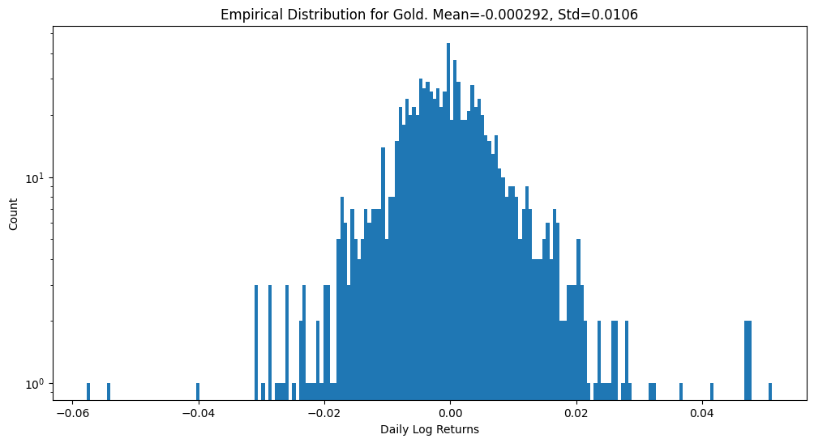
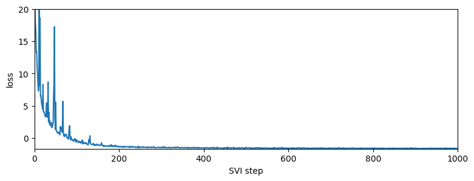
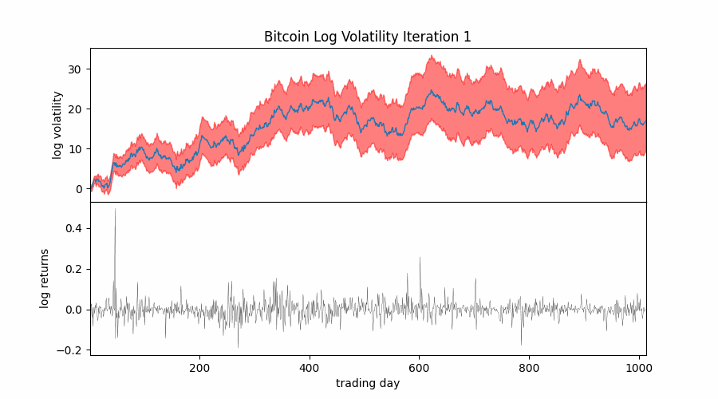
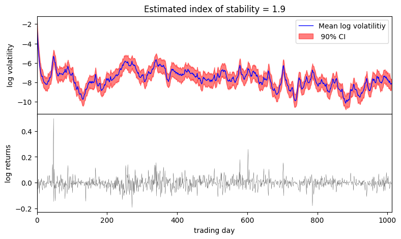
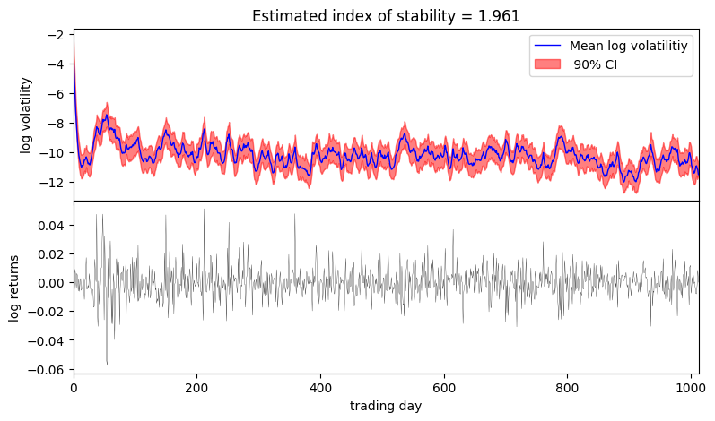

# 🌀  Volatility Modelling using Alpha Stable distribution
# 📈Introduction

## Aim of the Analysis

The objective of this analysis is to model and compare the volatility of Bitcoin and Gold prices using a **Bayesian model** with an **alpha-stable distribution**. The core idea is to assess which of these assets is more prone to **rare events and heavy-tailed behavior**. 

By examining the **tail properties** of the fitted alpha-stable distributions, we aim to determine whether Bitcoin or Gold exhibits a higher risk of extreme price movements. This comparison will help us understand the stability and risk characteristics of both assets, which is crucial for portfolio management, hedging strategies, and risk assessment.

---

## What is an Alpha-Stable Distribution?

The **alpha-stable distribution** generalizes the Gaussian distribution, allowing for **skewness** and **heavy tails**. It is widely used in finance to model returns that deviate from the assumptions of normality (such as **fat tails** and **asymmetric behavior**). 

Unlike a normal distribution, the alpha-stable distribution can capture **extreme events** with higher probability, which makes it suitable for modeling financial time series prone to **black swan events**.

The key parameters of the alpha-stable distribution are:
- **α (alpha)**: Stability parameter (0 < α ≤ 2). Lower values indicate **heavier tails** (higher chance of rare events).
- **β (beta)**: Skewness parameter (−1 ≤ β ≤ 1). Determines the asymmetry of the distribution.
- **γ (gamma)**: Scale parameter. Controls the spread or variability.
- **δ (delta)**: Location parameter. Represents the central tendency or shift.

For normal distributions, **α = 2**. As **α decreases**, the distribution becomes more "heavy-tailed," indicating a higher likelihood of rare, extreme movements.

## 📊 Differences from Classical Models

1. **Heavy-Tailed Behavior**:
   - Classical models often assume normal distributions, which can underestimate extreme market movements.
   - Levy stable models can capture extreme events better due to their heavy-tailed nature.

2. **Parameter Estimation**:
   - Traditional methods provide point estimates for parameters.
   - Bayesian models incorporate uncertainty in parameter estimation through Bayesian methods.
---
## Visualization of Actual Log Prices

Below are the **log-transformed prices** for **Bitcoin** and **Gold**. While these plots provide a general view of the price trends over time, they are **not particularly informative for detecting rare events** or understanding extreme behaviors. This is because rare events are better captured through the **distribution of log-returns** and their corresponding stability parameters.

### Log-Price Plot for Bitcoin & Gold

---

### Why Log Prices are Less Informative for Rare Events

While log prices smooth out the multiplicative nature of asset returns, they only reveal general price movements and **trend-following behavior**.  
- **Extreme events** (e.g., sudden spikes or crashes) are more visible in the **log-returns distribution**, not in cumulative log prices.  
- The **alpha-stable distribution** we modeled focuses on capturing these rare events, which are missed when looking only at the overall trend.

---

## Log-Returns of Bitcoin and Gold

The following plot provides an overview of the **log-returns** for Bitcoin and Gold over the given time period. Log-returns are useful for analyzing financial time series because they help normalize price changes, making the data more comparable over time. Observing the spikes in the log-returns can indicate times of extreme events or sudden market movements.

### Plot of Bitcoin and Gold Log-Returns

---

### Interpretation

- **Bitcoin**: As observed, Bitcoin shows higher volatility with several significant spikes, indicating frequent large price movements.
- **Gold**: Gold appears more stable, with fewer extreme movements compared to Bitcoin. However, rare events are still present in the form of small but sharp deviations.
---
## Empirical Distributions of Bitcoin and Gold Log-Returns

In addition to the time-series plot of log-returns, the following empirical distribution plots provide insights into the **probability distribution** of the log-returns for Bitcoin and Gold. 

### Why Empirical Distributions Matter?
The shape of the empirical distribution helps us understand the **heavy-tailed behavior** of each asset. A **normal distribution** assumption in financial models would underestimate the probability of extreme events, but the empirical distributions of Bitcoin and Gold often show **fatter tails**. This makes them suitable for modeling with **alpha-stable distributions**.

### Bitcoin Empirical Distribution

---

### Gold Empirical Distribution

---

### Comparison and Relevance
By visually comparing the two distributions:
- **Bitcoin** shows significantly fatter tails, reinforcing the need for non-Gaussian models like the alpha-stable distribution.
- **Gold** has thinner tails, meaning rare events are less likely, which aligns with its role as a stable asset in the financial markets.

These plots support the quantitative comparison of the **stability parameters (α)** in the next section, where we fit alpha-stable distributions to the log-returns of both assets.
## Mathematical Framework

In this analysis, the **log-returns** of Bitcoin and Gold prices are modeled using the following equations:

$\log p_t = \log p_{t-1} + \sqrt{h_t}$  

$\log h_t = \log h_{t-1} + \sigma \cdot v_t$

### Explanation of the Equations

1. **First Equation**:  
   This equation models the **log-price dynamics**.  
   - $\(\log p_t\)$ is the log-price at time \(t\).  
   - $\(\log p_{t-1}\)$ is the log-price at time \(t-1\).  
   - $\(\sqrt{h_t}\)$ accounts for **stochastic volatility**. This introduces randomness, meaning price changes are influenced by the **current level of volatility**.

2. **Second Equation**:  
   The second equation models the **evolution of volatility over time**, capturing **volatility clustering** (i.e., periods of high volatility followed by more high volatility).  
   - $\(\log h_t\)$ is the log-volatility at time \(t\).  
   - $\(\log h_{t-1}\)$ is the log-volatility at time \(t-1\).  
   - $\(v_t\)$ is a **stochastic term** representing the shocks to volatility.  
   - $\(\sigma\)$ is a **parameter** controlling the sensitivity of volatility to these shocks.

### Key Idea: Volatility Clustering

The **time-dependent volatility** (second equation) allows us to model **volatility clustering**, which is common in financial markets. This means that large price movements are often followed by large movements, and small movements are followed by small ones. 

---

## Implementation

Our model assumes that the **log-returns** of Bitcoin and Gold are distributed as:

$\log R_t \sim \text{Stable}(\alpha, \beta, \sqrt{h_t}, r_{\text{loc}})$

where:
- $\(\alpha\)$ is the **stability** parameter.
- $\(\beta\)$ is the **skewness** parameter.
- $\(\sqrt{h_t}\)$ is the **scale** or volatility parameter.
- $\(r_{\text{loc}}\)$ is the **location** parameter.

The goal of our analysis is to **infer these parameters** from the log-returns using **Stochastic Variational Inference (SVI)** to maximize the **Evidence Lower Bound (ELBO)**. Below is the implementation summary along with the necessary reparameterization details.

---

### SVI and ELBO Optimization

In Bayesian inference, **maximizing the ELBO** allows us to estimate the posterior distribution of the parameters efficiently. SVI is chosen for this task because it scales well with large datasets like financial time series.

The following plot shows the convergence of the ELBO during training, indicating that the model successfully learned the parameters:

As seen in the plot, the ELBO increases and stabilizes over time, suggesting that the variational inference is working as expected.

---

### Reparameterization of the Stable Distribution

Inference for **non-symmetric stable distributions** can be challenging because the **log-probability function (log_prob)** is not implemented for the general case. To overcome this, we use a **reparameterization trick** provided by Pyro that reparameterizes a Stable random variable as the sum of two other stable random variables:  
1. One symmetric  
2. One totally skewed

Reparameterizing the stable distribution makes the model more computationally efficient during optimization, reducing the complexity of sampling and inference.

---
## Visualization of Training Procedure

To better understand how the model learns the **log-volatility $(log \(h_t\)$)** over time, we created an **animated GIF**. This animation shows the evolution of the **log-volatility estimates** per epoch along with their **confidence intervals** and compares it to the actual log-returns.

### Description of the Visualization

- **Top subplot (Blue & Red)**:  
  Displays the evolution of the predicted **log-volatility $\( \log h_t \)$** across epochs.  
  - **Blue Line**: Mean prediction of $\( \log h_t \)$ at each epoch.  
  - **Red Shaded Region**: 90% **confidence interval** for the volatility estimate.

- **Bottom subplot (Grey)**:  
  Shows the **actual log-returns** over time, providing a comparison to see how well the model captures the volatility patterns.

---

### How to Interpret the Animation

1. **Learning Progress**:  
   As the epochs progress, the model gradually adjusts its estimate of $\( \log h_t \)$, improving its accuracy.

2. **Volatility Clustering**:  
   You can observe the **volatility clustering** behavior as the confidence intervals tighten during periods of low volatility and expand during high-volatility phases.

3. **Accuracy over Time**:  
   The **bottom subplot** helps you visually compare the log-volatility predictions against the **actual log-returns**, showing how well the model adapts to real market dynamics.

---
## Prediction Results for Volatility $(log \(h_t\))$

Below are the **predicted log-volatility $\( \log h_t \)$** plots for **Bitcoin** and **Gold** based on the trained model. These predictions reflect the model’s ability to capture **volatility clustering** and **non-Gaussian behaviors** present in financial time series.

### Prediction Plot for Bitcoin

### Prediction Plot for Gold

---

## Stability Parameter Estimates

The **stability parameter \( \alpha \)** reflects how “fat” the tails of the **alpha-stable distribution** are. A lower value of $\( \alpha \)$ corresponds to **heavier tails**, indicating a higher likelihood of **extreme events** (e.g., sudden crashes or spikes).

Below is a table summarizing the estimated stability parameters and their uncertainties:

| Asset    | Stability Parameter $\( \alpha \)$ | Uncertainty     |
|----------|----------------------------------|-----------------|
| Bitcoin  |  1.902                       | $\pm 0.008357 $ |
| Gold     |  1.959                       | $\pm 0.005908 $ |

---

### Comparison of Stability Parameters

From the table, we can draw the following conclusions:

- **Bitcoin** has a **lower stability parameter $(\(\alpha = 1.902\))$** compared to Gold, indicating **heavier tails** in its distribution of log-returns. This suggests Bitcoin is more prone to **rare, extreme events** (e.g., sudden price changes).
- **Gold** has a slightly higher stability parameter $(\(\alpha = 1.959\))$, meaning it exhibits **less extreme volatility** than Bitcoin, although still showing  non-Gaussian behavior.

In summary, **Bitcoin's price movements are more volatile and extreme** than those of Gold, as captured by the lower stability parameter $\( \alpha \)$.

---
